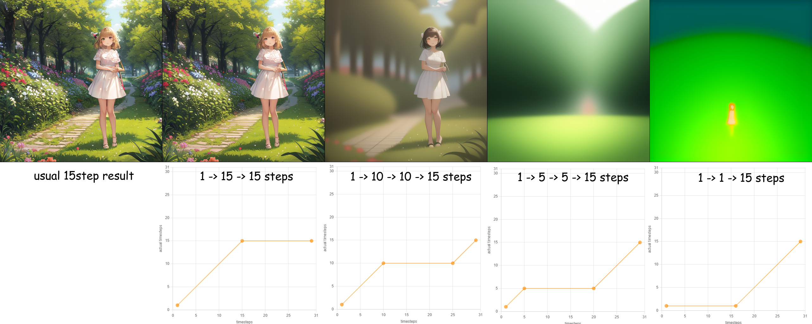
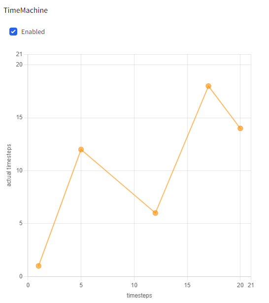

# TimeMachine - steps rearrangement for stable diffusion



## What is this?

This is an extension for [stable-diffusion-webui](https://github.com/AUTOMATIC1111/stable-diffusion-webui) which rearranges `timestep` parameter.

## How to use?

1. install this ext
2. add (click), move (drag) and remove (right-click) points in the graph in expandable `TimeMachine` section
3. generate images



```
left click: put a point
right click: remove a point
```
